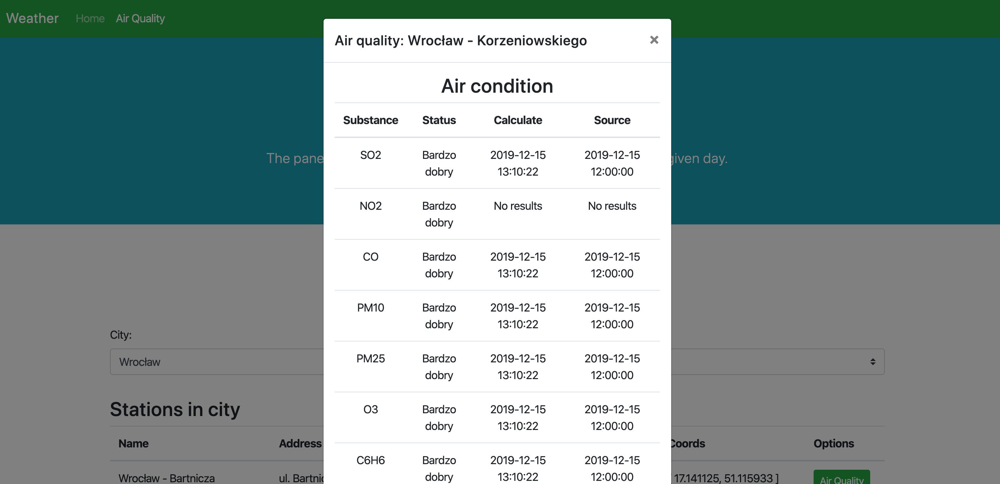

<h1 align="center">Welcome to Weather api 👋</h1>
<p>
  
</p>

> Platform providing weather air quality information.



[Link to FRONT repository](https://github.com/Pawel9903/weather-front)

## Install

```sh
composer install
```

## Author

👤 **Pawel9903**

* Github: [@Pawel9903](https://github.com/Pawel9903)
* LinkedIn: [@Paweł Ged](https://linkedin.com/in/paweł-ged-26038a15a/)
